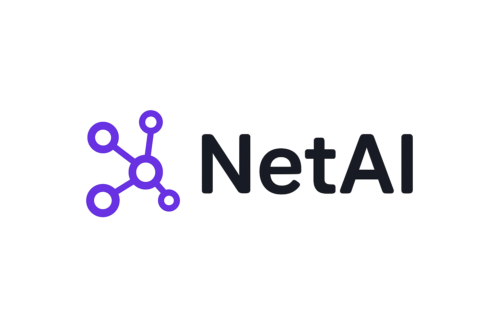

# Local AI Network Diagram Analyzer with Ollama

<div align="center">



**ระบบวิเคราะห์แผนผังเครือข่ายด้วย AI ที่ใช้ Ollama**

[](https://reactjs.org/)
[](https://www.typescriptlang.org/)
[](https://fastapi.tiangolo.com/)
[](https://www.sqlite.org/)
[](https://ollama.ai/)

[คู่มือการติดตั้ง](#การติดตั้ง) • [วิธีการใช้งาน](#วิธีการใช้งาน) • [คุณสมบัติ](#คุณสมบัติหลัก) • [API](#api-documentation)

</div>

---

## 📖 เกี่ยวกับระบบ

Local AI Network Diagram Analyzer เป็นระบบที่ช่วยให้คุณสามารถ:

- **สร้างแผนผังเครือข่าย** ด้วยอุปกรณ์เครือข่ายที่หลากหลาย
- **วิเคราะห์เครือข่ายด้วย AI** ผ่าน Ollama service
- **จัดการโปรเจกต์** หลายโปรเจกต์พร้อมประวัติการทำงาน
- **ส่งออกไฟล์** ในรูปแบบต่างๆ (PNG, SVG, JSON)
- **ติดตามประวัติการวิเคราะห์** พร้อมระบบค้นหาและกรอง

---

## 🚀 การติดตั้ง

### 📋 ความต้องการของระบบ

#### สำหรับ Frontend:
- **Node.js** >= 18.0.0
- **npm** หรือ **yarn**

#### สำหรับ Backend:
- **Python** >= 3.8
- **SQLite** (รวมมากับ Python แล้ว)
- **Ollama** AI Service (ติดตั้งแยก)

#### สำหรับ AI Service:
- **Ollama** >= 0.1.0
- **LLM Model** (แนะนำ: llama2, codellama, หรือ mistral)

### 🔧 การติดตั้งแบบ Step-by-Step

#### 1️⃣ ติดตั้ง Ollama AI Service

```bash
# Windows (ดาวน์โหลดจาก https://ollama.ai/)
# หรือใช้ PowerShell:
iwr -useb https://ollama.ai/install.ps1 | iex

# macOS
brew install ollama

# Linux
curl -fsSL https://ollama.ai/install.sh | sh

# ติดตั้ง AI Model
ollama pull gpt-oss:latest
# หรือ
ollama pull mistral
ollama pull codellama
```

#### 2️⃣ Clone โปรเจกต์

```bash
git clone https://github.com/wiraphong65/Public-Local-AI-Network-Diagram-Analyzer-with-Ollama.git
cd Local-AI-Network-Diagram-Analyzer-with-Ollama
```

#### 3️⃣ ตั้งค่า Backend

```bash
cd backend

# สร้าง Virtual Environment
python -m venv venv

# เปิดใช้งาน Virtual Environment
# Windows
venv\\Scripts\\activate
# macOS/Linux
source venv/bin/activate

# ติดตั้ง Dependencies
pip install -r requirements.txt

# สร้างไฟล์ .env
cp .env.example .env
```

**แก้ไขไฟล์ `.env`:**
```env
# Database Configuration (SQLite - ไม่จำเป็นต้องแก้ไข)
DATABASE_URL=sqlite:///./network_topology.db

# JWT Configuration
SECRET_KEY=your-super-secret-jwt-key
ACCESS_TOKEN_EXPIRE_MINUTES=30

# Ollama Configuration
OLLAMA_BASE_URL=http://localhost:11434
OLLAMA_MODEL=llama2
OLLAMA_TIMEOUT=3600

# Server Configuration
HOST=0.0.0.0
PORT=8007
```

**เริ่มต้น Database:**
```bash
# SQLite database จะถูกสร้างอัตโนมัติเมื่อรันครั้งแรก
# สร้าง Tables
python -c "from app.database import engine; from app import models; models.Base.metadata.create_all(bind=engine)"

# หรือใช้ Alembic (ถ้ามี)
alembic upgrade head
```

#### 4️⃣ ตั้งค่า Frontend

```bash
cd ../  # กลับไปที่ root directory

# ติดตั้ง Dependencies
npm install
# หรือ
yarn install

# สร้างไฟล์ .env.local (ถ้าจำเป็น)
echo "VITE_API_BASE_URL=http://localhost:8007" > .env.local
```

---

## 🏃‍♂️ การรันระบบ

### 🔴 เริ่มต้น Services ทั้งหมด

#### 1. เริ่ม Ollama AI Service
```bash
# Terminal 1: เริ่ม Ollama
ollama serve

# ตรวจสอบว่า service ทำงาน
curl http://localhost:11434/api/tags
```

#### 2. เริ่ม Backend API Server
```bash
# Terminal 2: เริ่ม Backend
cd backend
source venv/bin/activate  # หรือ venv\\Scripts\\activate สำหรับ Windows
python run.py

# หรือใช้ uvicorn โดยตรง
uvicorn app.main:app --host 0.0.0.0 --port 8007 --reload
```

#### 3. เริ่ม Frontend Development Server
```bash
# Terminal 3: เริ่ม Frontend
npm run dev
# หรือ
yarn dev
```

### 🌐 เข้าใช้งานระบบ

- **Frontend**: http://localhost:5173
- **Backend API**: http://localhost:8007
- **API Documentation**: http://localhost:8007/docs
- **Ollama Service**: http://localhost:11434

---

## 🎯 วิธีการใช้งาน

### 1️⃣ การสร้างบัญชีและเข้าสู่ระบบ

1. **สมัครสมาชิก**
   - เปิดเว็บไซต์ http://localhost:5173
   - คลิก "สมัครสมาชิก"
   - กรอกข้อมูล: อีเมล, ชื่อผู้ใช้, รหัสผ่าน
   - คลิก "สร้างบัญชี"

2. **เข้าสู่ระบบ**
   - กรอกอีเมลและรหัสผ่าน
   - คลิก "เข้าสู่ระบบ"

### 2️⃣ การสร้างและจัดการโปรเจกต์

1. **สร้างโปรเจกต์ใหม่**
   - คลิกปุ่ม "สร้างโปรเจกต์ใหม่" (+)
   - กรอกชื่อโปรเจกต์และคำอธิบาย
   - คลิก "สร้าง"

2. **เลือกโปรเจกต์**
   - คลิกที่ชื่อโปรเจกต์ในรายการ
   - หรือใช้ Dropdown เลือกโปรเจกต์

3. **จัดการโปรเจกต์**
   - **แก้ไข**: คลิกไอคอน edit (✏️)
   - **ลบ**: คลิกไอคอน delete (🗑️)
   - **บันทึก**: Ctrl+S หรือคลิกปุ่ม Save

### 3️⃣ การสร้างแผนผังเครือข่าย

#### 📦 เพิ่ม Network Devices

**อุปกรณ์ที่รองรับ:**
- 🖥️ **PC** - เครื่องคอมพิวเตอร์
- 🖥️ **Server** - เซิร์ฟเวอร์
- 🔄 **Router** - เราเตอร์
- 🔌 **Switch** - สวิตช์
- 🔒 **Firewall** - ไฟร์วอลล์
- 🔗 **Hub** - ฮับ
- 🌐 **ISP** - ผู้ให้บริการอินเทอร์เน็ต

**วิธีเพิ่ม Device:**
1. คลิกปุ่ม "+" ในแถบเครื่องมือ
2. เลือกประเภทอุปกรณ์
3. คลิกในพื้นที่แผนผังเพื่อวาง
4. แก้ไขชื่อและคุณสมบัติได้

#### ⚙️ การกำหนดคุณสมบัติ Device

**สำหรับ PC/Server:**
- **Label**: ชื่อแสดง
- **User Capacity**: จำนวนผู้ใช้ที่รองรับ
- **Max Throughput**: ความเร็วสูงสุด (Mbps/Gbps)
- **Device Role**: บทบาทในเครือข่าย

**สำหรับ Router/Switch/Hub:**
- **Label**: ชื่อแสดง
- **Max Throughput**: ความเร็วการประมวลผล
- **Device Role**: Core, Distribution, Access

**สำหรับ ISP:**
- **Label**: ชื่อผู้ให้บริการ
- **Max Throughput**: ความเร็วอินเทอร์เน็ต
- **Throughput Unit**: หน่วย (Mbps, Gbps)

#### 🔗 การสร้างการเชื่อมต่อ

1. **วิธีที่ 1: Drag & Drop**
   - ลากจาก handle ของ device หนึ่งไปยังอีก device
   - ระบบจะตรวจสอบความถูกต้องของการเชื่อมต่อ

2. **วิธีที่ 2: Connection Mode**
   - คลิกปุ่ม "Connection Mode"
   - คลิก device ต้นทาง
   - คลิก device ปลายทาง

**การกำหนดคุณสมบัติการเชื่อมต่อ:**
- **Bandwidth**: ความเร็วการเชื่อมต่อ
- **Bandwidth Unit**: หน่วย (Mbps, Gbps)
- **Label**: ชื่อการเชื่อมต่อ

### 4️⃣ การวิเคราะห์เครือข่ายด้วย AI

#### 🤖 เริ่มการวิเคราะห์

1. **เปิด AI Panel**
   - คลิกปุ่ม "AI" ในแถบเครื่องมือ
   - หรือกด shortcut key (ถ้ามี)

2. **ตรวจสอบสถานะ AI**
   - ดู AI Health Status (🟢 เขียว = พร้อมใช้งาน)
   - ตรวจสอบ Model ที่ใช้งาน

3. **เริ่มวิเคราะห์**
   - คลิกปุ่ม "วิเคราะห์เครือข่าย"
   - รอผลการวิเคราะห์ (อาจใช้เวลา 30-60 วินาที)

#### 📊 การดูผลการวิเคราะห์

**ผลการวิเคราะห์จะรวม:**
- 🏗️ **การวิเคราะห์โครงสร้าง**: Layer distribution, device placement
- 🔍 **การตรวจสอบปัญหา**: Bottlenecks, misconfigurations
- 📈 **การวิเคราะห์ Performance**: Bandwidth utilization, throughput analysis
- 💡 **คำแนะนำการปรับปรุง**: Security improvements, scalability suggestions
- 📋 **สรุปภาพรวม**: Network score และ priority recommendations

#### 📚 การจัดการประวัติการวิเคราะห์

1. **ดูประวัติ**
   - เปิด "History Tab" ใน AI Panel
   - ดูรายการการวิเคราะห์ทั้งหมด

2. **ค้นหาและกรอง**
   - ใช้ Search Box ค้นหา
   - กรองตามโปรเจกต์และช่วงเวลา

3. **จัดการประวัติ**
   - **ดูรายละเอียด**: คลิกที่รายการ
   - **ลบรายการ**: คลิกปุ่ม Delete
   - **ลบทั้งหมด**: คลิก "Clear All"

### 5️⃣ การส่งออกไฟล์

#### 📄 รูปแบบไฟล์ที่รองรับ

1. **PNG Image**
   - ความละเอียดสูง
   - พื้นหลังโปร่งใส
   - เหมาะสำหรับนำเสนอ

2. **SVG Vector**
   - ขยายได้ไม่เสียคุณภาพ
   - ขนาดไฟล์เล็ก
   - เหมาะสำหรับพิมพ์

3. **JSON Data**
   - ข้อมูลโครงสร้างเครือข่าย
   - สามารถ Import กลับได้
   - เหมาะสำหรับสำรองข้อมูล

#### 📥 วิธีการส่งออก

1. **เตรียมแผนผัง**
   - จัดตำแหน่ง device ให้เรียบร้อย
   - ตรวจสอบการเชื่อมต่อ

2. **เลือกรูปแบบ**
   - คลิกปุ่ม "Export" (📥)
   - เลือกรูปแบบไฟล์ที่ต้องการ

3. **ดาวน์โหลดไฟล์**
   - ระบบจะสร้างไฟล์และดาวน์โหลดอัตโนมัติ
   - ไฟล์จะถูกบันทึกในโฟลเดอร์ Downloads

### 6️⃣ ระบบ Undo/Redo

#### ⏪ การใช้งาน Undo/Redo

**Keyboard Shortcuts:**
- **Undo**: `Ctrl+Z` (Windows/Linux) หรือ `Cmd+Z` (macOS)
- **Redo**: `Ctrl+Y` (Windows/Linux) หรือ `Cmd+Shift+Z` (macOS)

**การทำงานที่รองรับ:**
- ✅ เพิ่ม/ลบ Device
- ✅ เพิ่ม/ลบ Connection
- ✅ แก้ไข Properties
- ✅ ย้ายตำแหน่ง Device
- ✅ การแก้ไขชื่อและค่าต่างๆ

**Floating Undo Widget:**
- แสดงสถานะ Undo/Redo
- แสดงจำนวนการดำเนินการ
- คลิกเพื่อ Undo/Redo ได้

---

## ⭐ คุณสมบัติหลัก

### 🎨 Network Diagram Editor
- ✅ **Visual Editor**: Drag & drop interface
- ✅ **7 Device Types**: PC, Server, Router, Switch, Firewall, Hub, ISP
- ✅ **Connection Validation**: ตรวจสอบการเชื่อมต่อที่ถูกต้อง
- ✅ **Port Management**: จัดการ port ของแต่ละอุปกรณ์
- ✅ **Auto Layout**: จัดเรียงอัตโนมัติ
- ✅ **Zoom & Pan**: ซูมและเลื่อนแผนผัง
- ✅ **Grid Snap**: จัดตำแหน่งตาม grid

### 🧠 AI-Powered Analysis
- ✅ **Ollama Integration**: ใช้ Local LLM models
- ✅ **Network Topology Analysis**: วิเคราะห์โครงสร้างเครือข่าย
- ✅ **Performance Assessment**: ประเมิน throughput และ bandwidth
- ✅ **Security Recommendations**: แนะนำการปรับปรุงความปลอดภัย
- ✅ **Bottleneck Detection**: ตรวจหาจุดคอขวด
- ✅ **Scalability Suggestions**: คำแนะนำการขยายระบบ

### 📊 Project Management
- ✅ **Multi-Project Support**: รองรับหลายโปรเจกต์
- ✅ **Auto-Save**: บันทึกอัตโนมัติ
- ✅ **Project History**: ประวัติการแก้ไข
- ✅ **Cloud Sync**: ซิงค์ข้อมูลกับ database
- ✅ **Project Sharing**: แชร์โปรเจกต์ (ถ้ามี user management)

### 📈 Analysis History
- ✅ **Complete History**: เก็บประวัติการวิเคราะห์ทั้งหมด
- ✅ **Project-Based Filtering**: กรองตามโปรเจกต์
- ✅ **Search Functionality**: ค้นหาในประวัติ
- ✅ **Export Analysis**: ส่งออกผลการวิเคราะห์
- ✅ **Performance Metrics**: วัดเวลาการประมวลผล

### 🎯 Export & Import
- ✅ **High-Quality PNG**: ความละเอียดสูง, พื้นหลังโปร่งใส
- ✅ **Scalable SVG**: Vector graphics ขยายได้ไม่เสียคุณภาพ
- ✅ **JSON Format**: ข้อมูลโครงสร้างสำหรับ backup/restore
- ✅ **Viewport Restoration**: กลับไปตำแหน่งเดิมหลัง export
- ✅ **Batch Export**: ส่งออกหลายรูปแบบพร้อมกัน

### 🔧 Advanced Features
- ✅ **Undo/Redo System**: Command pattern implementation
- ✅ **Keyboard Shortcuts**: เพิ่มความเร็วในการทำงาน
- ✅ **Responsive Design**: ใช้งานได้บนทุกหน้าจอ
- ✅ **Dark/Light Mode**: เปลี่ยนธีมได้
- ✅ **Real-time Collaboration**: (ถ้ามีการพัฒนาต่อ)

---

## 🔌 API Documentation

### 🔐 Authentication Endpoints

```http
POST /auth/register
Content-Type: application/json

{
  "email": "user@example.com",
  "username": "username",
  "password": "password123"
}
```

```http
POST /auth/token
Content-Type: application/json

{
  "username": "user@example.com",
  "password": "password123"
}
```

```http
GET /auth/me
Authorization: Bearer <access_token>
```

### 📁 Project Management Endpoints

```http
# Get all projects
GET /api/projects
Authorization: Bearer <access_token>

# Create new project
POST /api/projects
Authorization: Bearer <access_token>
Content-Type: application/json

{
  "name": "My Network Project",
  "description": "Network topology for office",
  "diagram_data": {}
}

# Update project
PUT /api/projects/{project_id}
Authorization: Bearer <access_token>
Content-Type: application/json

{
  "name": "Updated Project Name",
  "diagram_data": {...}
}

# Delete project
DELETE /api/projects/{project_id}
Authorization: Bearer <access_token>
```

### 🤖 AI Analysis Endpoints

```http
# Analyze network topology
POST /ai/analyze
Authorization: Bearer <access_token>
Content-Type: application/json

{
  "nodes": [...],
  "edges": [...],
  "project_id": 1
}

# Check AI service health
GET /ai/health
Authorization: Bearer <access_token>

# Get available models
GET /ai/models
Authorization: Bearer <access_token>
```

### 📊 Analysis History Endpoints

```http
# Get analysis history
GET /api/analysis-history?project_id=1&skip=0&limit=10
Authorization: Bearer <access_token>

# Delete analysis
DELETE /api/analysis-history/{analysis_id}
Authorization: Bearer <access_token>

# Clear all history
DELETE /api/analysis-history/clear-all?project_id=1
Authorization: Bearer <access_token>
```

---

## 🛠️ การแก้ไขปัญหา

### ❌ ปัญหาที่พบบ่อย

#### 1. **Ollama Service ไม่ทำงาน**
```bash
# ตรวจสอบสถานะ
ollama list

# เริ่ม service ใหม่
ollama serve

# ตรวจสอบ port
netstat -an | grep 11434
```

#### 2. **Database Connection ผิดพลาด**
```bash
# ตรวจสอบไฟล์ SQLite
ls -la network_topology.db

# ตรวจสอบการเชื่อมต่อ
sqlite3 network_topology.db ".tables"
```

#### 3. **Frontend ไม่เชื่อมต่อ Backend**
- ตรวจสอบ `VITE_API_BASE_URL` ในไฟล์ `.env.local`
- ตรวจสอบ CORS settings ใน backend
- ตรวจสอบว่า backend ทำงานที่ port 8007

#### 4. **AI Analysis ไม่ทำงาน**
```bash
# ตรวจสอบ AI model
ollama list

# ทดสอบ API
curl -X POST http://localhost:11434/api/generate \\
  -H "Content-Type: application/json" \\
  -d '{"model": "llama2", "prompt": "Hello"}'
```

### 🔧 การ Debug

#### Backend Logs
```bash
# ใน terminal ที่รัน backend
tail -f logs/app.log  # ถ้ามี logging file

# หรือดู console output
```

#### Frontend Debug
```javascript
// เปิด Browser DevTools (F12)
// ดู Console และ Network tabs
// ตรวจสอบ API calls และ error messages
```

#### Database Debug
```bash
# เปิด SQLite database
sqlite3 network_topology.db

# ใน SQLite prompt:
.tables                    -- ดู tables ทั้งหมด
.schema users             -- ดู schema ของ table users

# ตรวจสอบข้อมูล users
SELECT * FROM users LIMIT 5;

# ตรวจสอบข้อมูล projects  
SELECT * FROM projects LIMIT 5;

# ตรวจสอบ analysis history
SELECT * FROM ai_analysis_history ORDER BY created_at DESC LIMIT 5;

# ออกจาก SQLite
.quit
```

---

## 🚀 การ Deploy Production

### 🌐 Frontend (Static Hosting)

```bash
# Build production
npm run build

# Deploy ไป web server (nginx, apache, vercel, netlify)
# Files อยู่ในโฟลเดอร์ dist/
```

### 🖥️ Backend (Server Deployment)

```bash
# ใช้ Docker
docker build -t network-analyzer-backend .
docker run -p 8007:8007 network-analyzer-backend

# หรือใช้ systemd service
sudo nano /etc/systemd/system/network-analyzer.service
sudo systemctl enable network-analyzer
sudo systemctl start network-analyzer
```

### 🐳 Docker Compose (แนะนำ)

```yaml
# docker-compose.yml
version: '3.8'
services:
  backend:
    build: ./backend
    ports:
      - "8007:8007"
    environment:
      - DATABASE_URL=sqlite:///./network_topology.db
    volumes:
      - ./backend/network_topology.db:/app/network_topology.db
  
  ollama:
    image: ollama/ollama
    ports:
      - "11434:11434"
    volumes:
      - ollama_data:/root/.ollama

volumes:
  ollama_data:
```

---

## 📚 การพัฒนาต่อ

### 🔧 Development Setup

```bash
# Clone repo
git clone <repo-url>
cd Local-AI-Network-Diagram-Analyzer-with-Ollama

# ติดตั้ง dependencies
npm install
cd backend && pip install -r requirements.txt

# เริ่ม development
npm run dev
```

### 🏗️ โครงสร้างโปรเจกต์

```
Local-AI-Network-Diagram-Analyzer-with-Ollama/
├── 📁 backend/                 # FastAPI Backend
│   ├── 📁 app/                # Application code
│   │   ├── 📁 routers/        # API routes
│   │   ├── 📄 models.py       # Database models
│   │   ├── 📄 schemas.py      # Pydantic schemas
│   │   └── 📄 main.py         # FastAPI app
│   ├── 📄 requirements.txt    # Python dependencies
│   └── 📄 run.py             # Entry point
├── 📁 src/                    # React Frontend
│   ├── 📁 components/         # React components
│   ├── 📁 contexts/          # Context providers
│   ├── 📁 hooks/             # Custom hooks
│   ├── 📁 services/          # API services
│   └── 📁 utils/             # Utility functions
├── 📁 public/                 # Static assets
├── 📁 docs/                   # Documentation
├── 📄 package.json            # Node dependencies
└── 📄 README.md              # This file
```


<div align="center">

**สร้างด้วย ❤️ โดยใช้ React, FastAPI, และ Ollama AI**

[🔝 กลับไปด้านบน](#local-ai-network-diagram-analyzer-with-ollama)

</div>
